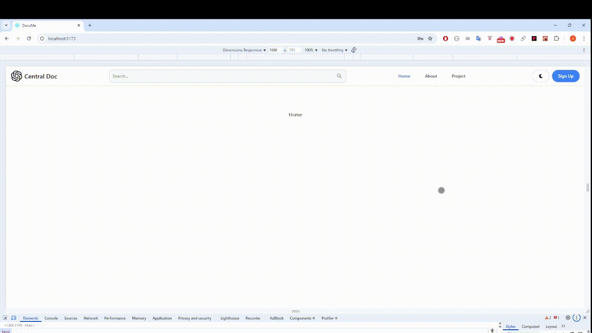
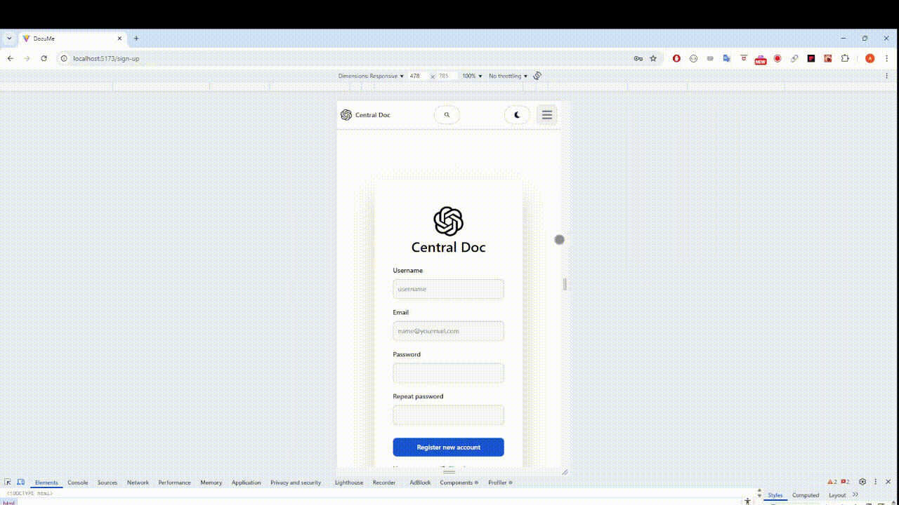
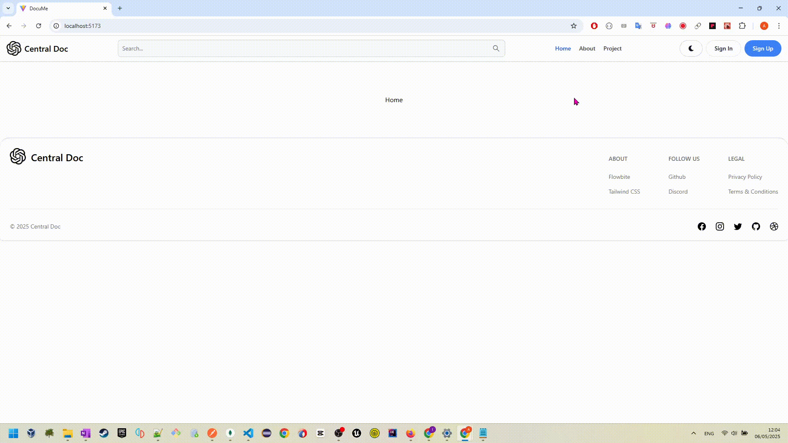

🔧 Work in progress — this project is still under development with more features being developed.

# 🛍️ React Document App

> A Documentation App built using MERN stack (MongoDB, ExpressJS, ReactJs, NodeJs) and Tailwind CSS. 
> This project includes multiple pages such as Home, Dashboard, Login, Register, Admin. 
>
> `

---

## 🎞️ Live Preview (GIF)

### 🏠 Home Page  

<br>
### 🛍️ Signup Page  

<br>
### 🛍️ Google Auth  

<br>


### MORE COMING SOON !!!
<br>

---

## 🛠️ Technologies Used
## Frontend:
- [React](https://reactjs.org/)
- [Vite](https://vitejs.dev/)
- [React Router](https://reactrouter.com/)
- [Tailwind CSS](https://tailwindcss.com/)
- [Redux Toolkit](https://redux-toolkit.js.org/)  
- HTML
- JavaScript
- LocalStorage
- [JSON Web Token (JWT)](https://jwt.io/)
- [Zod (Form Validation)](https://zod.dev/)
- [react-hook-form](https://react-hook-form.com/)
- [Axios](https://axios-http.com/)
- [React Query *(Planned)*](https://tanstack.com/query/latest/docs/framework/react/overview)
- [Flowbite UI](https://flowbite-react.com/docs/guides/vite#3-install-flowbite-react)
- [React Icon](https://react-icons.github.io/react-icons/)

## Backend:
- **Node.js**
- **Express**
- **Mongoose**
- **MongoDB**
- **dotenv**
- **bcrypt**
- **nodemon** (for development)
---

## 🚀 Getting Started

### 📄 Configuration
## Backend:
Create a file at:

```
./api/config/config.env
```

With the following content:

```env
PORT=3000
NODE_ENV=development

MONGO_URI = mongodb://localhost:27017/<db name>
JWT_SECRET=ldsfjldskfjdslfjlsdfkjdsl
JWT_EXPIRE=20d
JWT_COOKIE_EXPIRE=20

FIREBASE_PROJECT_ID=

```

## Frontend:
Create a file at:

```
./client/.env.development
```

With the following content:

```env
VITE_API_URL=http://localhost:3000/api/v1
VITE_API_TOKEN_NAME=token
VITE_FIREBASE_API_KEY=

```

## Run Command:

```bash
# Install dependencies
npm install

# Run development server for backend
# Inside root folder
npm run dev

# Run development server for frontend
# Inside folder /client
npm run dev